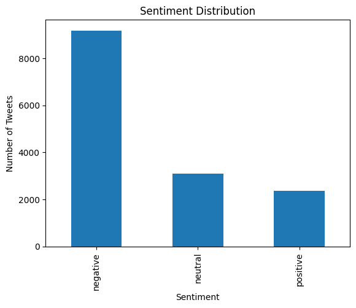
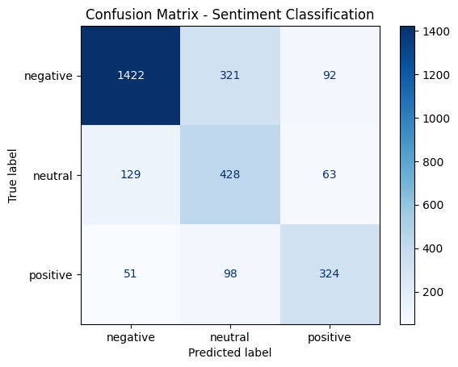

# Report: Multi-Class Sentiment Analyzer with Error Analysis

**Dataset:** Twitter US Airline Sentiment
**Task:** 3-class text classification (positive / neutral / negative)
**Techniques:** Text cleaning → TF-IDF → Logistic Regression → Evaluation → Error Analysis

---

## 1. Introduction

Sentiment analysis identifies the opinion or emotion expressed in a piece of text. This
project builds a multi-class sentiment analyzer that classifies airline-related tweets into
three classes — **positive**, **neutral**, and **negative** — using only basic NLP
techniques (no deep learning / transformers), and then performs an error analysis to
understand *why* the model gets things wrong.

## 2. Objective

- Build a text classifier that assigns one of three sentiment labels to a tweet.
- Evaluate the classifier using standard classification metrics.
- Manually inspect misclassified examples to identify systematic weaknesses (negation,
  sarcasm, mixed opinions, neutral wording, rare vocabulary).

## 3. Dataset

- **Source:** Twitter US Airline Sentiment dataset.
- **File:** `Datasets/airline_tweets_dataset.csv`
- **Raw shape:** 14,640 rows × 15 columns.
- **Columns used:** `text` and `airline_sentiment` (renamed to `sentiment`).
- **No missing values** in `text` or `sentiment` after selecting these two columns.

### Class distribution

| Sentiment | Count |
|---|---|
| Negative | 9,178 |
| Neutral | 3,099 |
| Positive | 2,363 |

The dataset is clearly **imbalanced**, dominated by negative tweets (airline complaints are
common on Twitter). This is addressed later using `class_weight="balanced"` in the model.

## 4. Text Cleaning

Each tweet was cleaned with a simple, deterministic function before vectorization:

- Lowercased.
- URLs removed (`http\S+`).
- `@mentions` removed (e.g. `@VirginAmerica`).
- Hashtag symbol removed but the word kept (`#delayed` → `delayed`).
- Punctuation and digits removed.
- Extra whitespace collapsed.

No rows became empty after cleaning, so no additional rows were dropped at this stage.

## 5. Train/Test Split

- **80% train / 20% test**, stratified on `sentiment` so all three classes keep their
  relative proportions in both sets.
- Train size: **11,712** tweets.
- Test size: **2,928** tweets.

## 6. Feature Extraction — TF-IDF

- `TfidfVectorizer(max_features=5000, ngram_range=(1, 2), stop_words="english")`
- Captures both single words (unigrams) and two-word phrases (bigrams), which helps with
  short negation patterns like `"not bad"` or `"no delay"`.
- Resulting feature matrix: 11,712 × 5,000 (train), 2,928 × 5,000 (test).

## 7. Model — Logistic Regression

- `LogisticRegression(max_iter=1000, class_weight="balanced", random_state=42)`
- `class_weight="balanced"` compensates for the negative-heavy class distribution by
  weighting minority classes (neutral, positive) more heavily during training.

## 8. Evaluation

**Overall accuracy: 74.25%**

### Classification report

| Class | Precision | Recall | F1-score | Support |
|---|---|---|---|---|
| Negative | 0.89 | 0.77 | 0.83 | 1,835 |
| Neutral | 0.51 | 0.69 | 0.58 | 620 |
| Positive | 0.68 | 0.68 | 0.68 | 473 |
| **Accuracy** | | | **0.74** | 2,928 |
| Macro avg | 0.69 | 0.72 | 0.70 | 2,928 |
| Weighted avg | 0.77 | 0.74 | 0.75 | 2,928 |

The model is strongest on the **negative** class — it's the largest class and negative
tweets tend to use clearly negative vocabulary (delay, cancelled, rude, worst). It is
weakest on **neutral**, which has the lowest precision (0.51): many tweets predicted as
neutral are actually negative or positive, because neutral language often lacks strong
sentiment cues.

### Confusion matrix

| Actual \ Predicted | Negative | Neutral | Positive |
|---|---|---|---|
| **Negative** | 1,422 | 321 | 92 |
| **Neutral** | 129 | 428 | 63 |
| **Positive** | 51 | 98 | 324 |

## 9. Error Analysis

- **Total test samples:** 2,928
- **Total errors:** 754
- **Error rate:** 25.75%

### Most common confusion pairs

| Actual → Predicted | Count |
|---|---|
| Negative → Neutral | 321 |
| Neutral → Negative | 129 |
| Positive → Neutral | 98 |
| Negative → Positive | 92 |
| Neutral → Positive | 63 |
| Positive → Negative | 51 |

The **negative ↔ neutral** boundary accounts for the largest share of errors (321 + 129 =
450 of 754, ~60%). This matches expectations: mildly negative or matter-of-fact complaint
tweets often read as neutral to a bag-of-words model that has no strong negative keywords to
latch onto.

### Example misclassifications (neutral tweets predicted as negative)

Manually reviewing tweets where the actual label was `neutral` but the model predicted
`negative` surfaced several patterns:

- **Sparse / ambiguous text:** very short tweets (e.g. a single leftover word after
  cleaning) give the model almost no signal to work with.
- **Matter-of-fact statements about problems** that aren't actually complaints, e.g. tweets
  asking a question about a cancelled flight or a fee, which contain negative-sounding
  words (*cancelled*, *fee*, *bummer*) without expressing a negative opinion.
- **Mild disappointment softened by acceptance** — tweets that acknowledge an inconvenience
  but explicitly say it's understandable (e.g. framing a delay as a normal part of business)
  get pulled toward negative because of the surface-level negative word, even though the
  overall tone is neutral/resigned rather than critical.

### Other known failure categories (general, from the pipeline design)

1. **Negation** — e.g. *"The movie was not bad"* mixes a negative word (`bad`) with a
   negator (`not`), which can confuse a bag-of-words style model despite bigrams helping
   somewhat.
2. **Mixed opinions** — e.g. *"The acting was good but the story was boring"* contains both
   positive and negative cues in one sentence.
3. **Neutral sentiment** — neutral tweets often lack strong emotional words, making them the
   hardest class to separate (confirmed above — lowest precision/recall trade-off).
4. **Sarcasm** — e.g. *"Great, another delay"* uses a positive word ironically; TF-IDF has
   no way to detect tone.
5. **Rare vocabulary** — words that appear rarely in training get little to no weight in the
   TF-IDF representation, so the model has no learned signal for them at test time.

## 10. Limitations

- **Bag-of-words representation:** TF-IDF captures word importance, not sentence meaning or
  word order beyond bigrams.
- **Limited context:** sentences with contrasting clauses (*"I thought it would be bad, but
  it was actually excellent"*) can confuse the model.
- **No sarcasm detection:** a fundamentally basic limitation of TF-IDF + Logistic
  Regression.
- **Class imbalance:** even with `class_weight="balanced"`, the neutral class remains the
  hardest to classify precisely.

## 11. Possible Improvements

- Collect or oversample more neutral and positive examples to reduce imbalance.
- Try alternative basic models (Multinomial Naive Bayes, linear SVM) for comparison.
- Add explicit negation handling (e.g. tagging words following "not"/"never"/"no").
- Move to contextual embeddings or transformer-based models for a stronger baseline, once
  the basic-NLP version has been demonstrated.

## 12. Conclusion

This project built a multi-class sentiment analyzer using text cleaning, TF-IDF, and
Logistic Regression, reaching **74.25% accuracy** on a held-out test set of 2,928 tweets.
The model performs well on clearly negative tweets but struggles most at the negative/
neutral boundary, which accounts for roughly 60% of all misclassifications. Error analysis
confirms that the model's weaknesses — negation, sarcasm, mixed opinions, and low-signal
neutral language — are consistent with the known limitations of bag-of-words style NLP
approaches, and point toward concrete next steps (more neutral training data, negation
handling, or contextual embeddings) for improving performance.
